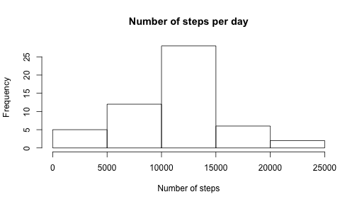
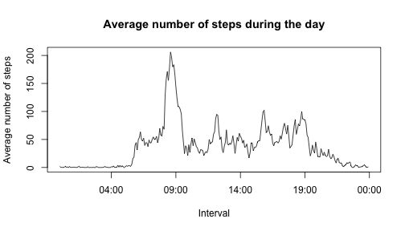
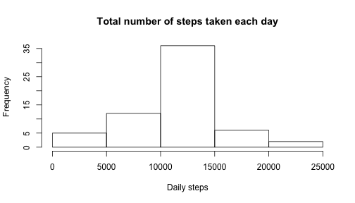
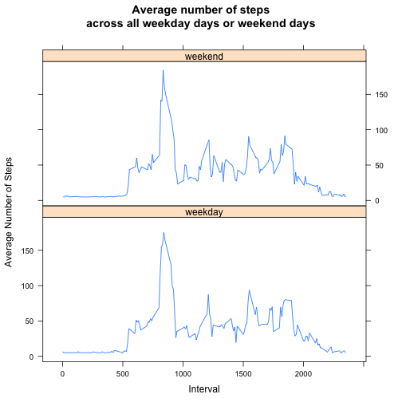

# Reproducible Research: Peer Assessment 1
## Introduction

It is now possible to collect a large amount of data about personal movement using activity monitoring devices. These type of devices are part of the “quantified self” movement – a group of enthusiasts who take measurements about themselves regularly to improve their health, to find patterns in their behavior, or because they are tech geeks.  

This assignment makes use of data from a personal activity monitoring device. This device collects data at 5 minute intervals through out the day. The data consists of two months of data from an anonymous individual collected during the months of October and November, 2012 and include the number of steps taken in 5 minute intervals each day.

## Loading and preprocessing the data


```r
datafile <- unzip("activity.zip")
data <- read.csv(datafile)
```
The variables included in this dataset are:  
__steps__: Number of steps taking in a 5-minute interval (missing values are coded as NA)  
__date__: The date on which the measurement was taken in YYYY-MM-DD format  
__interval__: Integer identifier for the 5-minute interval in which measurement was taken

The dataset has a total of 17,568 observations in three variables.

```r
str(data)
```

```
## 'data.frame':	17568 obs. of  3 variables:
##  $ steps   : int  NA NA NA NA NA NA NA NA NA NA ...
##  $ date    : Factor w/ 61 levels "2012-10-01","2012-10-02",..: 1 1 1 1 1 1 1 1 1 1 ...
##  $ interval: int  0 5 10 15 20 25 30 35 40 45 ...
```

## What is mean total number of steps taken per day?
To get a first impression of the sort of data we are working on we start with the average number of steps the sample person takes every day (disregarding NA values) and we draw a histogram.  
1. Calculate the total number of steps taken per day.  

```r
steps.sum <- tapply(data$steps, data$date, sum)
print(steps.sum)
```

```
## 2012-10-01 2012-10-02 2012-10-03 2012-10-04 2012-10-05 2012-10-06 
##         NA        126      11352      12116      13294      15420 
## 2012-10-07 2012-10-08 2012-10-09 2012-10-10 2012-10-11 2012-10-12 
##      11015         NA      12811       9900      10304      17382 
## 2012-10-13 2012-10-14 2012-10-15 2012-10-16 2012-10-17 2012-10-18 
##      12426      15098      10139      15084      13452      10056 
## 2012-10-19 2012-10-20 2012-10-21 2012-10-22 2012-10-23 2012-10-24 
##      11829      10395       8821      13460       8918       8355 
## 2012-10-25 2012-10-26 2012-10-27 2012-10-28 2012-10-29 2012-10-30 
##       2492       6778      10119      11458       5018       9819 
## 2012-10-31 2012-11-01 2012-11-02 2012-11-03 2012-11-04 2012-11-05 
##      15414         NA      10600      10571         NA      10439 
## 2012-11-06 2012-11-07 2012-11-08 2012-11-09 2012-11-10 2012-11-11 
##       8334      12883       3219         NA         NA      12608 
## 2012-11-12 2012-11-13 2012-11-14 2012-11-15 2012-11-16 2012-11-17 
##      10765       7336         NA         41       5441      14339 
## 2012-11-18 2012-11-19 2012-11-20 2012-11-21 2012-11-22 2012-11-23 
##      15110       8841       4472      12787      20427      21194 
## 2012-11-24 2012-11-25 2012-11-26 2012-11-27 2012-11-28 2012-11-29 
##      14478      11834      11162      13646      10183       7047 
## 2012-11-30 
##         NA
```
2. Make a histogram of the total number of steps taken each day:

```r
hist(steps.sum, main="Number of steps per day", xlab="Number of steps")
```

 

3. Calculate and report the mean and median of the total number of steps taken per day.  

```r
summary(steps.sum)
```

```
##    Min. 1st Qu.  Median    Mean 3rd Qu.    Max.    NA's 
##      41    8841   10760   10770   13290   21190       8
```

```r
mean.steps <- mean(steps.sum, na.rm=T)
median.step <- median(steps.sum, na.rm=T)
```
The mean is 1.0766189 &times; 10<sup>4</sup> and the median is 10765.

## What is the average daily activity pattern?
Now we look at the average daily activity, that is how many steps we take during the day, in the morning, for example, or at night?  
4. Make a time series plot (i.e. type = "l") of the 5-minute interval (x-axis) and the average number of steps taken, averaged across all days (y-axis):  

```r
steps.interval <- tapply(data$steps, data$interval, mean, na.rm=T)
intervals <- strptime(sprintf("%04d", as.numeric(names(steps.interval))), format="%H%M")
plot(intervals, steps.interval, type="l", main="Average number of steps during the day", xlab="Interval", ylab="Average number of steps")
```

 
  
5. Which 5-minute interval, on average across all the days in the dataset, contains the maximum number of steps?


```r
steps.interval[order(steps.interval, decreasing = TRUE)][1]
```

```
##      835 
## 206.1698
```
where the first value is the time of the day and the second the number of steps.


## Imputing missing values  
Note that there are a number of days/intervals where there are missing values (coded as NA). The presence of missing days may introduce bias into some calculations or summaries of the data.  
6. Calculate and report the total number of missing values in the dataset (i.e. the total number of rows with NAs):

```r
s <- sum(is.na(data$steps))
```
The total number of missing values is 2304.  
7. Devise a strategy for filling in all of the missing values in the dataset.  
The strategy will be putting in place of NA the average number of steps across all intervals in the dataset.  

```r
# generating a new copy
data2 <- data
mean.na <- mean(steps.sum, na.rm=TRUE)/288
data2$steps <- ifelse(is.na(data2$steps), mean.na, data2$steps)
```

The value that will substitute every NA is 37.3825996.  
8. Create a new dataset that is equal to the original dataset but with the missing data filled in:  
The new dataset will be:

```r
head(data2)
```

```
##     steps       date interval
## 1 37.3826 2012-10-01        0
## 2 37.3826 2012-10-01        5
## 3 37.3826 2012-10-01       10
## 4 37.3826 2012-10-01       15
## 5 37.3826 2012-10-01       20
## 6 37.3826 2012-10-01       25
```
9. Make a histogram of the total number of steps taken each day and calculate and report the mean and median total number of steps taken per day. Do these values differ from the estimates from the first part of the assignment? What is the impact of imputing missing data on the estimates of the total daily number of steps?
This is the histogram

```r
steps2.sum <- tapply(data2$steps, data2$date, sum)
hist(steps2.sum, main="Total number of steps taken each day", xlab="Daily steps")
```

 

```r
smr <- summary(steps2.sum)
mean2.steps <- mean(steps2.sum)
median2.step <- median(steps2.sum)
```
The new data are the following and they not differ very much from the previous histogram in which NA were present: mean = 1.0766189 &times; 10<sup>4</sup>; median = 1.0766189 &times; 10<sup>4</sup>.  
The impact of imputing missing data is eliminating zero values in the night hours. It should be important to analyse further the question.  


## Are there differences in activity patterns between weekdays and weekends?

9. Create a new factor variable in the dataset with two levels – “weekday” and “weekend” indicating whether a given date is a weekday or weekend day.

```r
library("dplyr")
data2$date <- as.Date(data2$date)
data.final <- select(data2, steps, date, interval)
data.final <- mutate(data.final, weekday = weekdays(date))

dayVect <- c("Monday", "Tuesday", "Wednesday", "Thursday", "Friday")
data.final <- data.final %>% mutate(wdays = ifelse(data2$weekday %in% dayVect, "weekday", "weekend"))
```

```
## Error in eval(expr, envir, enclos): wrong result size (0), expected 17568 or 1
```

```r
data.final$wdays <- factor(c("weekday", "weekend"))
```
10. Make a panel plot containing a time series plot (i.e. type = "l") of the 5-minute interval (x-axis) and the average number of steps taken, averaged across all weekday days or weekend days (y-axis).  

```r
library("lattice")
data.final <- group_by(data.final, interval, wdays)
mean.steps.wkd <- summarize(data.final, msteps=mean(steps))
xyplot(msteps ~ interval | wdays, data = mean.steps.wkd, type="l", main="Average number of steps\nacross all weekday days or weekend days", ylab="Average Number of Steps", xlab="Interval", layout = c(1,2))
```

 
